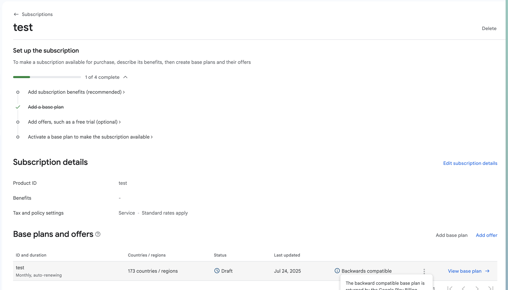
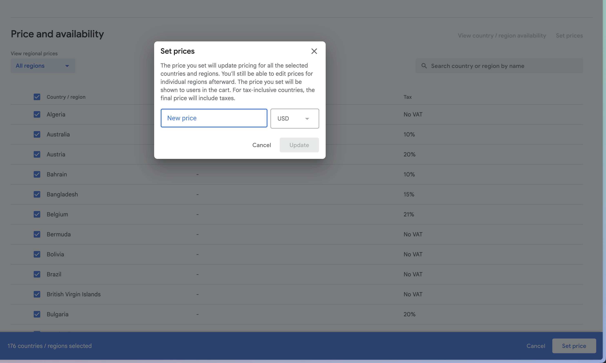
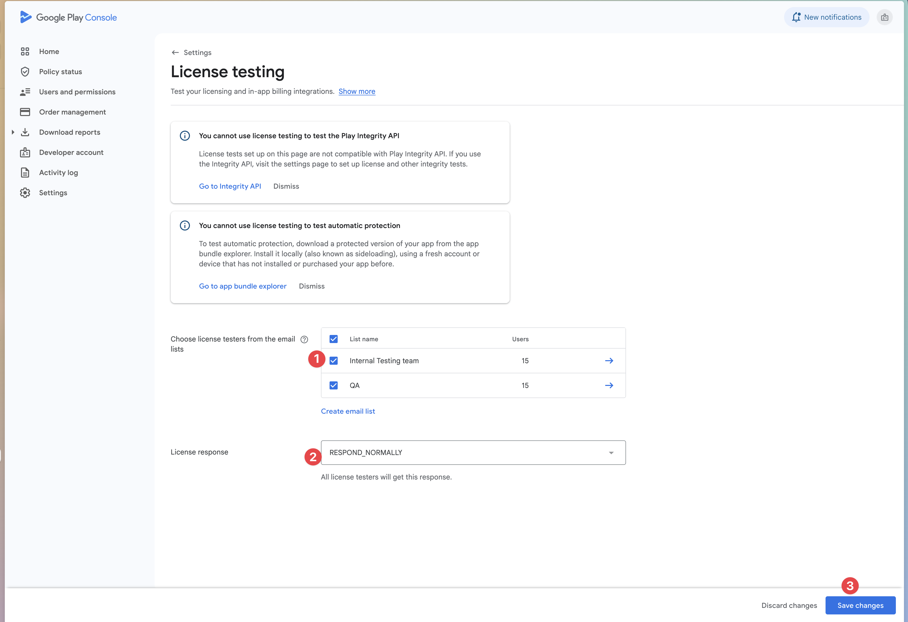
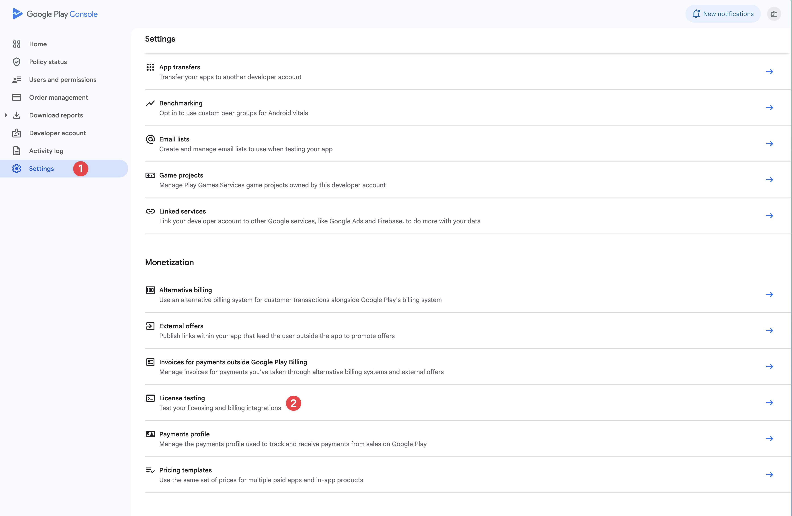

# Testing Android In-App Purchases: Complete Guide

This guide covers testing Android in-app purchases using Google Play Console and various testing methods.

## Recommended Testing Method: License Testing

**License Testing** is the best approach for Android IAP development:

- **No app uploads** - Test with debug builds directly
- **Multiple test scenarios** - Various payment responses
- **Fast iteration** - No review process delays  
- **Free testing** - No charges for test purchases
- **Real billing flow** - Simulates actual Google Play integration

**Play Billing Lab** (optional advanced testing):
- Download: [Play Billing Lab](https://play.google.com/store/apps/details?id=com.google.android.apps.play.billingtestcompanion)
- Test different regions and payment methods
- Must be a license tester to access

## Prerequisites

- **Google Play paid developer account** ($25 one-time fee)
- **App already released in Google Play Console** 
- **Billing permission** in your `AndroidManifest.xml`:
  ```xml
  <uses-permission android:name="com.android.vending.BILLING" />
  ```

## Product Configuration

1. **Navigate to Monetize → Products**
2. **Create In-App Products**
   - Product ID (must match your code)
   - Title and description
   - Price in your default currency
   - Activate the product





## License Testing Setup

### Step 1: Configure License Testers

1. **Go to Setup → License testing** in Play Console
2. **Add Gmail accounts** under "License testers" section
   - Enter email addresses (one per line)
   - Must be valid Gmail accounts
   - Testers will receive email invitation


3. **Configure test responses:**
   - **PURCHASED** - Simulates successful purchase
   - **CANCELED** - Simulates user cancellation  
   - **UNAVAILABLE** - Simulates product unavailable
   - **ITEM_ALREADY_OWNED** - Simulates already purchased

**License Tester Benefits:**
- Can sideload debug builds without uploading to Play Store
- Bypass Google Play signature verification
- Test with various payment methods including test instruments
- No real charges for test purchases



### Step 2: Test with License Accounts

1. **Sign in** to test device with license testing account
2. **Install app** (can be debug build or sideloaded APK)
3. **Available test instruments:**
   - Test card (always approves)
   - Test card (always declines) 
   - Slow test card (approves after few minutes)
   - Slow test card (declines after few minutes)
4. **Test purchases** - responses will be simulated based on your configuration
5. **No real transactions** are processed

**Testing Benefits:**
- Works with debug builds and custom signatures
- No need to upload to Play Store for each test
- Test various payment scenarios with test instruments
- Ideal for automated testing flows

> ⚠️ **Note**: License testing uses simulated responses, so it's good for testing purchase flow but not for validating real Google Play integration.

## Play Billing Lab Testing (Optional)

### Setup Play Billing Lab

1. **Download from Play Store:** [Play Billing Lab](https://play.google.com/store/apps/details?id=com.google.android.apps.play.billingtestcompanion)
   - Only accessible to license testers
2. **Sign in** with your license tester account  
3. **Configure testing settings:**
   - Select test country/region
   - Enable real payment methods (requires permissions)
   - Apply configuration changes

### Regional Testing

1. **Select desired country** in Play Billing Lab
2. **Apply changes** and restart your app
3. **Test purchase flow** in selected region
4. **Verify pricing** and currency display

**Alternative without Play Billing Lab:**
- Create Gmail account in target country
- Use VPN to desired region
- Clear Play Store data/cache between tests

### Real Payment Method Testing

**Note:** Requires special permissions from Google Play Business Development.

1. **Enable real payment methods** in Play Billing Lab
2. **Test with actual payment instruments**
3. **Request refunds** for test purchases to avoid charges

## Testing Scenarios

### Basic Purchase Testing

1. **Load products** using your product IDs
2. **Initiate purchase** for each product type
3. **Handle purchase result**:
   - Success → Acknowledge purchase
   - Pending → Wait for completion
   - Error → Handle gracefully

### Pending Transaction Testing

Test pending transactions using license testers with slow test cards:

1. **Test declining payment:**
   - Use "Slow test card, declines after a few minutes"
   - Purchase should show as `PENDING` initially
   - After few minutes, purchase fails
   - Verify app handles failure gracefully

2. **Test approving payment:**
   - Use "Slow test card, approves after a few minutes" 
   - Purchase shows as `PENDING` initially
   - After few minutes, purchase becomes `PURCHASED`
   - Verify app grants access when state changes

### Acknowledgment Testing

**CRITICAL**: All purchases must be acknowledged within 3 days or they will be automatically refunded.

```typescript
// Example acknowledgment
import { NativePurchases } from '@capgo/native-purchases';

try {
  const purchases = await NativePurchases.queryPurchases();
  
  for (const purchase of purchases.purchases) {
    if (purchase.purchaseState === 'PURCHASED' && !purchase.acknowledged) {
      await NativePurchases.acknowledgePurchase({
        purchaseToken: purchase.purchaseToken
      });
    }
  }
} catch (error) {
  console.error('Acknowledgment failed:', error);
}
```

## Testing Tools and Debugging

### 1. Google Play Console Testing Tools

- **Order management** - View all test transactions
- **Financial reports** - Analyze test transaction data


### 2. Android Debug Logging

Add comprehensive logging to track purchase flow:

```typescript
console.log('🔍 Querying products:', productIds);
console.log('📦 Products found:', products.length);
console.log('💳 Launching purchase for:', productId);
console.log('✅ Purchase successful:', purchase.orderId);
```

### 3. Testing Checklist

- [ ] Products load correctly
- [ ] Purchase flow completes
- [ ] Purchases are acknowledged
- [ ] Error scenarios handled gracefully
- [ ] Network failures handled properly

## Troubleshooting Common Issues

### Products Not Loading

1. **Check Google Play Console**:
   - Products are created and activated
   - App is published (at least to internal testing)
   - Correct package name and signing

2. **Verify API Integration**:
   - Correct product IDs in code
   - Proper billing client initialization
   - Network connectivity on device

3. **Account Issues**:
   - Test account has payment method
   - Account region matches product availability
   - Not using developer account for purchases (use test account)

### Purchase Failures

1. **Common Causes**:
   - Missing payment method
   - Insufficient funds
   - VPN interfering with location
   - App not properly signed

2. **Debug Steps**:
   - Check BillingResult response codes
   - Verify purchase token generation
   - Test with different accounts
   - Check Google Play Console logs

### Testing Environment Issues

1. **Device Requirements**:
   - Google Play Store installed and updated
   - Google Play Services available
   - Valid Google account signed in

2. **App Requirements**:
   - Proper signing (release or debug keystore)
   - Correct package name
   - Compatible Android version

## Advanced Testing Scenarios

### 1. Multi-Device Testing

- **Purchase on Device A** → Verify on Device B
- **Purchase status sync** across devices
- **Offline purchase** → Sync when online

### 2. Already Owned Products

Test scenarios where user already owns a product:
- **Attempt to purchase again** → Should show "already owned"
- **Restore purchases** → Verify owned status

## Google Play Product Display Guidelines

### 📋 Recommended Practices

While Google Play is less strict than Apple, following these practices improves user experience and compliance:

### Best Practices for Product Display

1. **Use Real Product Data**
   ```typescript
   // Recommended: Use actual product details
   product.title                         // Product name from Play Console
   product.priceString               // Formatted price
   product.description                  // Product description
   ```

2. **Handle Localization**
   ```typescript
   // Google Play handles currency conversion automatically
   const price = product.priceString;
   // Displays as "$9.99", "€8.99", "¥1000", etc. based on user's region
   ```

3. **Dynamic Content Benefits**
   - **Automatic currency conversion** for international users
   - **Tax inclusion** where required by local law  
   - **Promotional pricing** updates automatically
   - **A/B testing** price changes through Play Console

### ❌ Not Recommended

```typescript
// Avoid hardcoded values
<div>Premium Plan - $9.99</div>  // Static price
```

### ✅ Recommended

```typescript
// Use dynamic product data
<div>{product.title} - {product.priceString}</div>
```

### Testing Product Display

- [ ] **Prices** show in correct local currency
- [ ] **Names** match Play Console configuration
- [ ] **Descriptions** display properly
- [ ] **Special offers** appear when configured

> 💡 **Note**: Unlike iOS, Google Play won't reject apps for hardcoded prices, but using dynamic data provides better user experience and international support.

## Security and Validation

### 1. Server-Side Verification

Always verify purchases on your server:

```typescript
// Send purchase token to your server for verification
const purchaseData = {
  purchaseToken: purchase.purchaseToken,
  productId: purchase.productId,
  orderId: purchase.orderId
};

// POST to your verification endpoint
await fetch('/api/verify-purchase', {
  method: 'POST',
  headers: { 'Content-Type': 'application/json' },
  body: JSON.stringify(purchaseData)
});
```

### 2. Local Verification

Verify purchase signature locally:

```typescript
import { NativePurchases } from '@capgo/native-purchases';

async function verifyPurchase(purchase: any): Promise<boolean> {
  try {
    // Verification is handled by the native layer
    // Just check if purchase is valid
    return purchase.purchaseState === 'PURCHASED' && 
           purchase.purchaseToken && 
           purchase.signature;
  } catch (error) {
    console.error('Verification failed:', error);
    return false;
  }
}
```

## Best Practices

### For Development
- Use **Internal Testing** for most development work
- Test with multiple Google accounts
- Verify purchase acknowledgment timing
- Test offline/online scenarios

### For Pre-Release
- Test with **License Testing** for automated flows
- Verify payment failure scenarios
- Validate server-side verification

### For Production
- Monitor purchase completion rates
- Track acknowledgment timing
- Handle all possible billing result codes
- Implement robust retry mechanisms

## Testing Timeline

**Week 1-2**: Basic setup and product testing
- Set up Google Play Console
- Create products and test accounts
- Implement basic purchase flow

**Week 3-4**: Advanced scenarios
- Test error handling
- Test multi-device scenarios

**Week 5+**: Production preparation
- Server-side verification
- Security hardening
- Performance optimization

## Additional Resources

- [Google Play Billing Documentation](https://developer.android.com/google/play/billing)
- [Play Console Help](https://support.google.com/googleplay/android-developer/)
- [Billing Library Integration Guide](https://developer.android.com/google/play/billing/integrate)
- [Official Testing Guide](https://developer.android.com/google/play/billing/test#billing-testing-test)

---

## Images Status

### 📸 Screenshots Needed

The following screenshots should be captured to complete this visual guide:

**Google Play Console (3 images still needed):**
- ✅ `edit_product_android.png` - Product creation interface (added)
- ✅ `set_price_android.png` - Product pricing setup (added)
- ✅ `license_testing.png` - License testing configuration (added)
- ✅ `license_testing_add_users.png` - Adding license testers (added)
- 📸 `internal-testing-setup.png` - Internal testing track setup
- 📸 `internal-app-sharing.png` - Internal app sharing interface
- 📸 `order-management.png` - Order management dashboard

**Android Device (2 images still needed):**
- 📸 `android-purchase-flow.png` - Google Play purchase dialog
- 📸 `google-play-testing.png` - Testing environment indicators

### 📋 How to Capture Screenshots

1. **Google Play Console**: Use browser screenshots at 1920x1080 resolution
2. **Android Device**: Use device screenshots or emulator captures
3. **Optimization**: Compress images to maintain < 300KB file sizes
4. **Annotations**: Add arrows/highlights to important UI elements

Once screenshots are added, update the image references in this guide and remove this section.

---

*This guide provides comprehensive coverage of Android in-app purchase testing methods and best practices.* 
